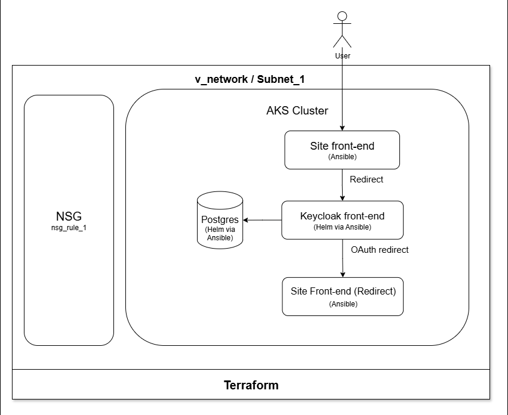

# AKS + Keycloak Authentication

This project sets up a production-style Kubernetes environment on Azure using AKS. It deploys a Keycloak identity provider with an attached Postgres database and a static website protected by Keycloak authentication.

The goal is to demonstrate Infrastructure-as-Code (IaC) principles using **Terraform**, **Ansible**, **Helm**, and **GitHub Actions** to fully automate provisioning, configuration, and teardown of a cloud-native authentication setup.
<p align="center">
  
</p>
<p align="center">
  
</p>

---

## 🎯 Architecture Overview


Components:
- **AKS**: Azure Kubernetes Service cluster for container orchestration
- **Keycloak**: Open-source identity and access management
- **Postgres**: Used as the backing database for Keycloak
- **Static site**: A basic static website protected via Keycloak login
- **GitHub Actions**: CI/CD for deploy, configure, and teardown
- **Terraform**: Provisions AKS, networking, and related resources
- **Ansible**: Deploys and configures all workloads inside AKS
- **Helm**: Used via Ansible to install Keycloak and Postgres charts

---



---

## 🧱 Infrastructure Breakdown

| Component   | Provisioned With | Justification |
|-------------|------------------|----------------|
| AKS         | Terraform         | Production-ready managed Kubernetes with Azure-native integration |
| Postgres    | Helm via Ansible  | Reliable Bitnami chart, external DB required by Keycloak |
| Keycloak    | Helm via Ansible  | Open-source, well-documented IAM with OIDC support |
| Static Site | Ansible + K8s     | Simple web frontend protected by Keycloak |
| GitHub Actions | YAML Pipelines | Automates provisioning, configuration, and teardown |

---

## ⚙️ Git Workflow

This project uses a basic Git workflow:

- All changes merged via Pull Requests
- Branches used:
  - `prod` – stable deployment
  - `dev` – implementation

---

## 🛠️ Setup and Usage

### Prerequisites

- Terraform Cloud account with API token set as TF_TOKEN_app_terraform_io in GitHub Secrets
- Terraform
- Ansible
- kubectl
- helm

### CLI Deployment, Configuration, Teardown

```bash
./scripts/deploy.sh   # Deploy
./scripts/config.sh   # Reapplies all Ansible roles and Terraform modules to reconfigure
./scripts/teardown.sh # Teardown
```

### Deployment via GitHub actions

1. Trigger the `deploy.yml` GitHub Action
2. This will:
   - Run Terraform to provision AKS
   - Output kubeconfig file
   - Run Ansible to deploy Keycloak, Postgres, and the static site

### Configuration via Github actions

Trigger the `configure.yml` workflow to reapply Ansible roles (e.g., config changes)

### Teardown via Github actions

Trigger the `teardown.yml` GitHub Action to destroy all cloud infrastructure (`terraform destroy`)

### Usage

Keycloak credentials are defined in Ansible role variables. Change them in roles/keycloak/tasks/main.yaml before deploying.

---

## 🔐 Authentication Flow

1. User visits site
2. Site redirects to Keycloak login
3. After successful login, user is redirected back
4. Static site confirms the user is authenticated

---

## 🔄 Dynamic Configuration Flow (IP Discovery + Injection)

1. Ansible waits for both Keycloak and Static Site LoadBalancer IPs to become available
2. The Keycloak IP is injected into the static site's HTML via Jinja2 template
3. The Static Site IP is then used to configure Keycloak clients via REST API
This ensures mutual routing is configured dynamically and correctly without hardcoded values

---

## 📌 Design Decisions

| Decision              | Rationale |
|-----------------------|-----------|
| **Terraform for AKS** | Industry standard for reproducible IaC |
| **Ansible for app config** | Better suited for K8s resource templating and Helm integration |
| **Helm for Keycloak & Postgres** | Enables fast deployment using stable, community-maintained charts |
| **Keycloak + Postgres** | Open-source, flexible, and widely adopted |
| **Static Site + Keycloak** | Demonstrates real-world OAuth flow |
| **No Ingress used** | Simplicity – LoadBalancer services are used instead |
| **GitHub Actions** | Native CI/CD for GitHub, no need for external runners |

Why Keycloak over Azure AD?
Keycloak is open-source, self-hosted, and OIDC-compliant. It offers full control over authentication flows and user federation. Azure AD is proprietary, and incur licensing, cost and vendor lock-in.

Why use Helm instead of raw kubectl YAML?
Helm charts provide reusable, parameterized templates with production-ready defaults. This reduces boilerplate and improves maintainability.

Why Kubernetes on AKS?
Kubernetes provides scalable, portable container orchestration. AKS offers managed Kubernetes with integrated monitoring, autoscaling, and Azure-native networking. Unlike Docker Compose or App Services, Kubernetes is closer to real-world production infrastructure, making it ideal for deploying highly scalable service workloads.

---

## 🌱 Extensions / Possible Features

- Ingress + TLS: Enables domain-based routing and secure HTTPS connections, which are required in production environments.
- Monitoring with Prometheus + Grafana: Provides visibility into cluster and app performance, critical for debugging and scaling.
- OpenTelemetry Tracing: Enables distributed tracing for identifying latency bottlenecks across services.
- Postgres Backup/Restore: Adds data safety and disaster recovery capability, essential for production databases.
- Integrate external IdP (Google, GitHub) with Keycloak

---

## 📁 Project Structure

<pre> 
├───.github
│   └───workflows
│
├───ansible
│   ├───inventory
│   ├───roles
│   │   ├───keycloak
│   │   │   └───tasks
│   │   ├───keycloak_config
│   │   │   └───tasks
│   │   ├───postgres
│   │   │   └───tasks
│   │   └───site
│   │       ├───tasks
│   │       └───templates
│   └───vars
├───kubeconfig
├───modules
│   ├───cluster
│   ├───NSG
│   └───vnet
├───scripts
└───site
</pre>
---

## 👤 Author

[Glitcher255](https://github.com/glitcher255)

---

## 📝 License

This project is licensed under the [MIT License](./LICENSE).